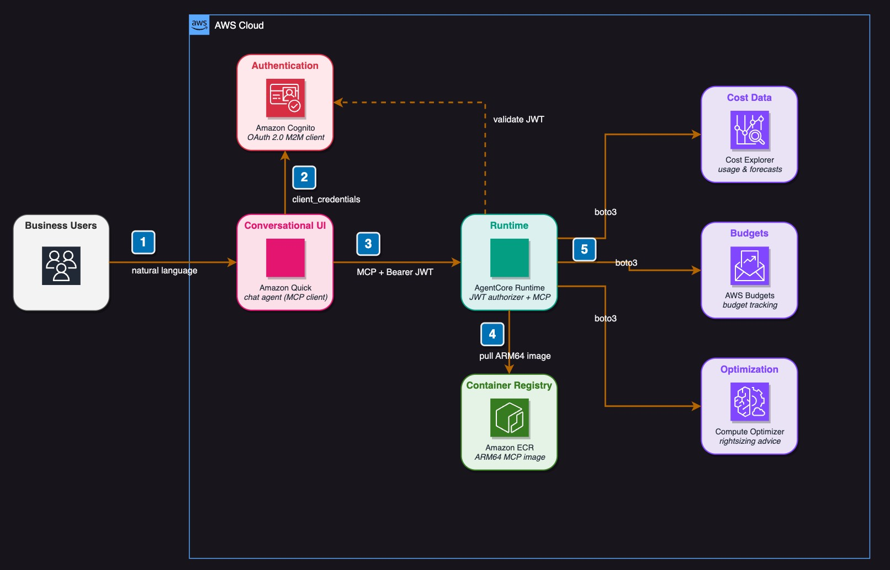
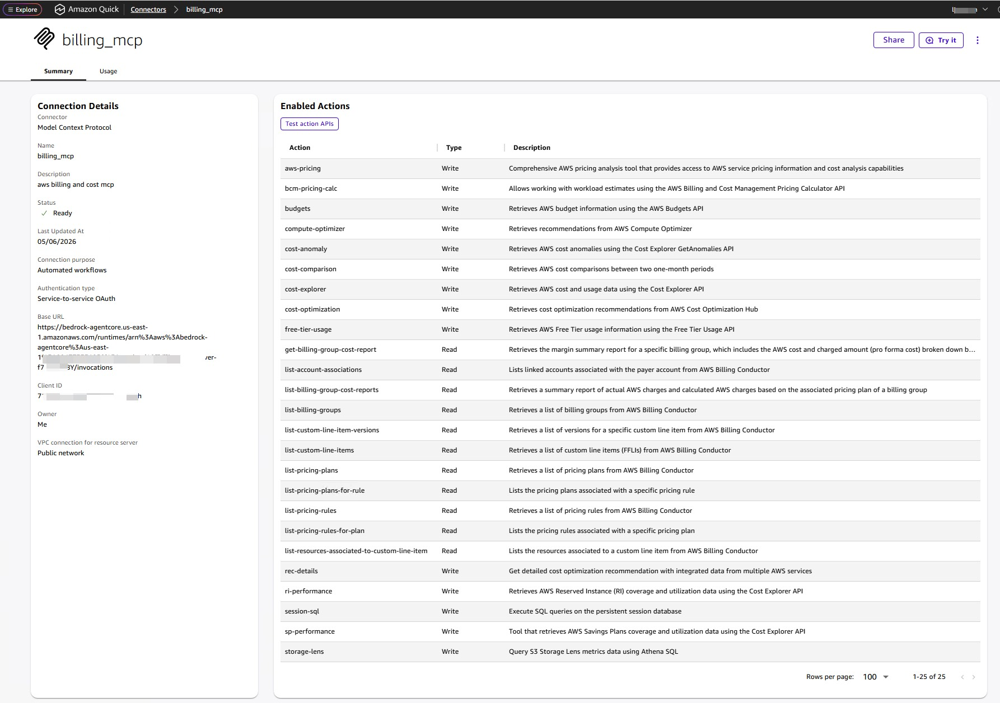
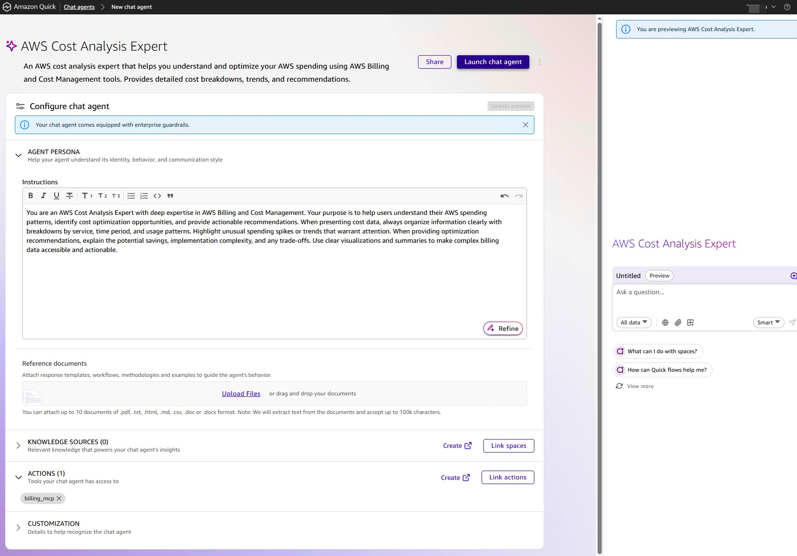
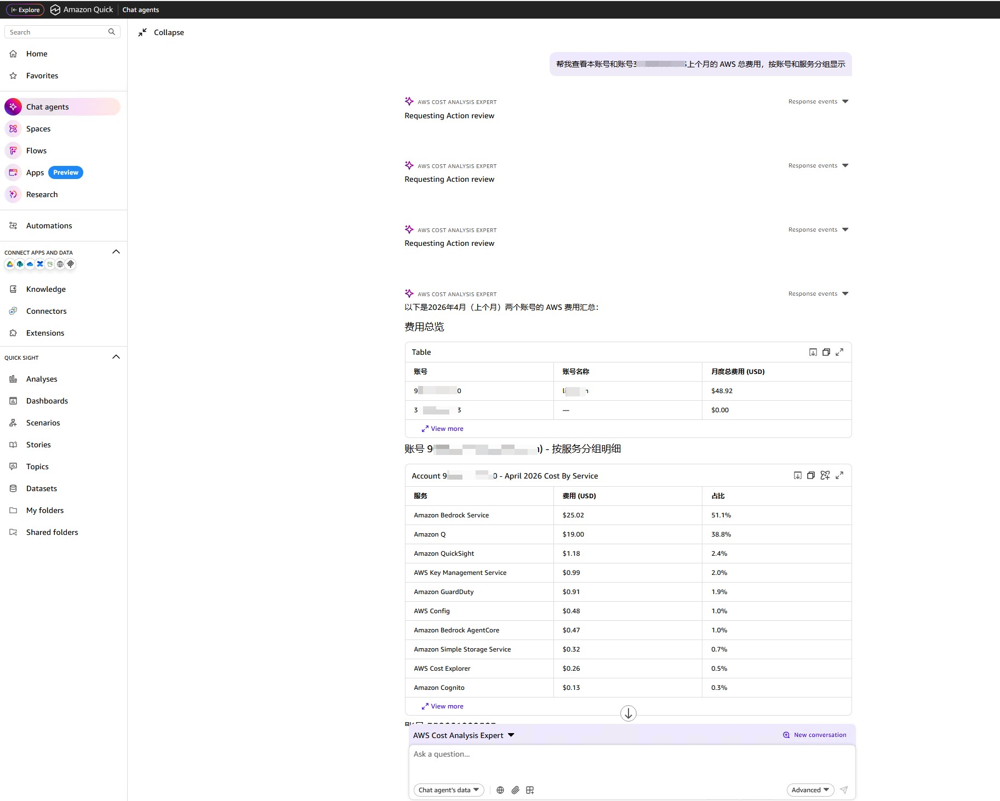

# 部署 Billing and Cost Management MCP Server 到 AgentCore Runtime 并接入 Amazon Quick（Service Authentication）

## 1. 方案概述

### 1.1 目标

让业务用户能够在 Amazon Quick 的对话界面中用自然语言查询 AWS 账单与成本数据——包括费用明细、成本趋势、预算执行情况、预留实例覆盖率、优化建议等。

技术上，通过将 [billing-cost-management-mcp-server](https://github.com/awslabs/mcp/tree/main/src/billing-cost-management-mcp-server) 部署到 Amazon Bedrock AgentCore Runtime，以 MCP 协议对接 Quick Chat Agent，并使用 Service Authentication (2LO) 实现安全的机器间认证。

### 1.2 源码改造概述

本仓库基于 [billing-cost-management-mcp-server](https://github.com/awslabs/mcp/tree/main/src/billing-cost-management-mcp-server) 上游源码，做了两方面改造。所有改造均通过 [Kiro](https://kiro.dev) 以 Vibe Coding 的方式完成。改造细节参见 [source-modification-guide.md](./docs/source-modification-guide.md)。

**1. AgentCore Runtime 适配**

上游源码默认使用 stdio 传输，仅支持本地运行。为了部署到 AgentCore Runtime 并接入 Amazon Quick，做了以下适配：

- **传输协议**：从 stdio 改为 streamable-http，监听 `0.0.0.0:8000`，满足 AgentCore Runtime 的 HTTP 协议要求
- **容器环境兼容**：容器内以非 root 用户运行，原始代码在源码目录下创建日志和 SQLite session 文件夹会因权限不足而失败，添加了 `/tmp` fallback
- **Amazon Quick 类型兼容**：Cost Explorer 的 `metrics` 参数从 JSON 字符串类型改为原生列表类型，解决 Amazon Quick Action Review 界面的类型校验报错

**2. 跨账号查询支持**

上游源码仅支持查询部署所在账号的账单数据。为支持多账号场景，新增了跨账号 assume role 能力：

- **本账号识别**：查询本账号时自动跳过 assume role，避免不必要的角色切换
- **管理账号防御**：LLM 在查询时可能自行添加 `LINKED_ACCOUNT` 过滤条件，但管理账号不在该维度中，会导致返回空结果。通过 prompt 引导和代码层面的递归清理双重防御解决

跨账号方案的架构设计参见 [cross-account-design.md](./docs/cross-account-design.md)。

### 1.3 架构



```
Amazon Quick Chat Agent (MCP 客户端)
        │
        │  HTTPS (streamable-http + OAuth 2.0 / 2LO client_credentials)
        ▼
Amazon Bedrock AgentCore Runtime
        │
        │  容器内部 0.0.0.0:8000/mcp
        ▼
billing-cost-management-mcp-server (ARM64 容器)
        │
        │  boto3 (使用执行角色的临时凭证)
        ▼
AWS Cost Explorer / Budgets / Compute Optimizer / ... 等 API
```

### 1.4 关键约束

| 约束项 | 要求 |
|--------|------|
| 传输协议 | streamable-http（stateless 模式） |
| 监听地址 | `0.0.0.0:8000`，路径 `/mcp` |
| 容器架构 | ARM64（AWS Graviton），由 CDK 自动构建部署 |
| 认证方式 | OAuth 2.0 JWT Bearer Token（Cognito） |
| Quick 认证 | Service authentication (2LO)，需将 Amazon Quick 的 M2M Client ID 加入 AgentCore 的 allowedClients |

> 参考文档：
> - [Deploy MCP servers in AgentCore Runtime](https://docs.aws.amazon.com/bedrock-agentcore/latest/devguide/runtime-mcp.html)
> - [MCP protocol contract](https://docs.aws.amazon.com/bedrock-agentcore/latest/devguide/runtime-mcp-protocol-contract.html)
> - [Amazon Quick MCP integration](https://docs.aws.amazon.com/quick/latest/userguide/mcp-integration.html)

---

## 2. 前置条件与工具安装

### 前置条件

- Python 3.10+、git
- AWS CLI v2 已配置凭证
- jq 已安装
- Amazon Quick Enterprise 订阅，用户拥有 Author Pro 角色

### 步骤 1：安装 Node.js、uv 和 AgentCore CLI

> **注意**：AgentCore CLI 已从旧版 Python 包 `bedrock-agentcore-starter-toolkit` 迁移到新版 npm 包 `@aws/agentcore`。
> 如果之前安装过旧版 CLI，请先卸载：`pip uninstall bedrock-agentcore-starter-toolkit`

```bash
# 安装 Node.js 22（使用 nvm）
curl -o- https://raw.githubusercontent.com/nvm-sh/nvm/v0.40.3/install.sh | bash
source ~/.bashrc
nvm install 22
nvm use 22
node --version

# 安装 python
sudo dnf install -y python3.14 python3.14-pip
python3.14 --version

# 安装 uv（Python 包管理器，AgentCore CLI 依赖它管理 Python 项目）
curl -LsSf https://astral.sh/uv/install.sh | sh
uv --version

# 安装新版 AgentCore CLI（npm 包）
npm install -g @aws/agentcore
agentcore --help
```

### 步骤 2：克隆源码

```bash
git clone https://github.com/sunl/billing-cost-management-mcp-server-for-amazon-quick.git
```

### 步骤 3：本地测试（可选）

如果需要在部署前验证 MCP Server 能正常启动，可以在源码目录下安装依赖并运行：

```bash
cd billing-cost-management-mcp-server-for-amazon-quick

# 安装 Python 依赖
python3.14 -m venv .venv
source .venv/bin/activate
pip install --upgrade pip
pip install -e .

# 启动 MCP Server
python awslabs/billing_cost_management_mcp_server/server.py

# 新开终端，发送 MCP initialize 请求验证
curl -X POST http://localhost:8000/mcp \
  -H "Content-Type: application/json" \
  -H "Accept: application/json, text/event-stream" \
  -d '{"jsonrpc":"2.0","id":1,"method":"initialize","params":{"protocolVersion":"2024-11-05","capabilities":{},"clientInfo":{"name":"test","version":"1.0"}}}'
```

预期返回包含 `serverInfo` 和工具列表的 JSON 响应。

> 注意：MCP 协议要求 Accept header 同时包含 `application/json` 和 `text/event-stream`。

---

## 3. 配置 IAM 执行角色

首先设置后续步骤需要的环境变量：

```bash
# 验证 AWS 凭证是否已正确配置（如果报错说明凭证未配置或已过期，需先修复再继续）
aws sts get-caller-identity

export AWS_REGION=us-east-1
export AWS_DEFAULT_REGION=us-east-1
export AWS_ACCOUNT_ID=$(aws sts get-caller-identity --query Account --output text)
```

### 步骤 4：创建信任策略和角色

```bash
cat > trust-policy.json << EOF
{
  "Version": "2012-10-17",
  "Statement": [{
    "Sid": "AssumeRolePolicy",
    "Effect": "Allow",
    "Principal": {"Service": "bedrock-agentcore.amazonaws.com"},
    "Action": "sts:AssumeRole",
    "Condition": {
      "StringEquals": {"aws:SourceAccount": "${AWS_ACCOUNT_ID}"},
      "ArnLike": {"aws:SourceArn": "arn:aws:bedrock-agentcore:${AWS_REGION}:${AWS_ACCOUNT_ID}:*"}
    }
  }]
}
EOF

aws iam create-role \
  --role-name BillingMCPServerAgentCoreRole \
  --assume-role-policy-document file://trust-policy.json \
  --description "AgentCore Runtime Role - Billing MCP Server"
```

### 步骤 5：添加 AgentCore 基础权限

```bash
cat > agentcore-base-policy.json << EOF
{
  "Version": "2012-10-17",
  "Statement": [
    {"Sid": "ECRImageAccess", "Effect": "Allow", "Action": ["ecr:BatchGetImage","ecr:GetDownloadUrlForLayer"], "Resource": ["arn:aws:ecr:${AWS_REGION}:${AWS_ACCOUNT_ID}:repository/*"]},
    {"Sid": "ECRTokenAccess", "Effect": "Allow", "Action": ["ecr:GetAuthorizationToken"], "Resource": "*"},
    {"Sid": "LogsCreate", "Effect": "Allow", "Action": ["logs:DescribeLogStreams","logs:CreateLogGroup"], "Resource": ["arn:aws:logs:${AWS_REGION}:${AWS_ACCOUNT_ID}:log-group:/aws/bedrock-agentcore/runtimes/*"]},
    {"Sid": "LogsDescribe", "Effect": "Allow", "Action": ["logs:DescribeLogGroups"], "Resource": ["arn:aws:logs:${AWS_REGION}:${AWS_ACCOUNT_ID}:log-group:*"]},
    {"Sid": "LogsWrite", "Effect": "Allow", "Action": ["logs:CreateLogStream","logs:PutLogEvents"], "Resource": ["arn:aws:logs:${AWS_REGION}:${AWS_ACCOUNT_ID}:log-group:/aws/bedrock-agentcore/runtimes/*:log-stream:*"]},
    {"Sid": "XRay", "Effect": "Allow", "Action": ["xray:PutTraceSegments","xray:PutTelemetryRecords","xray:GetSamplingRules","xray:GetSamplingTargets"], "Resource": "*"},
    {"Sid": "Metrics", "Effect": "Allow", "Action": "cloudwatch:PutMetricData", "Resource": "*", "Condition": {"StringEquals": {"cloudwatch:namespace": "bedrock-agentcore"}}}
  ]
}
EOF

aws iam put-role-policy \
  --role-name BillingMCPServerAgentCoreRole \
  --policy-name AgentCoreBasePolicy \
  --policy-document file://agentcore-base-policy.json
```

### 步骤 6：添加 Billing and Cost Management API 权限

```bash
cat > billing-mcp-policy.json << 'EOF'
{
  "Version": "2012-10-17",
  "Statement": [
    {"Sid": "CostExplorer", "Effect": "Allow", "Action": ["ce:GetCostAndUsage","ce:GetCostAndUsageWithResources","ce:GetCostAndUsageComparisons","ce:GetCostComparisonDrivers","ce:GetCostForecast","ce:GetUsageForecast","ce:GetDimensionValues","ce:GetTags","ce:GetCostCategories","ce:GetReservationPurchaseRecommendation","ce:GetReservationCoverage","ce:GetReservationUtilization","ce:GetSavingsPlansUtilization","ce:GetSavingsPlansCoverage","ce:GetSavingsPlansUtilizationDetails","ce:GetSavingsPlansPurchaseRecommendation","ce:GetAnomalies"], "Resource": "*"},
    {"Sid": "CostOptimizationHub", "Effect": "Allow", "Action": ["cost-optimization-hub:GetRecommendation","cost-optimization-hub:ListRecommendations","cost-optimization-hub:ListRecommendationSummaries"], "Resource": "*"},
    {"Sid": "ComputeOptimizer", "Effect": "Allow", "Action": ["compute-optimizer:GetAutoScalingGroupRecommendations","compute-optimizer:GetEBSVolumeRecommendations","compute-optimizer:GetEC2InstanceRecommendations","compute-optimizer:GetECSServiceRecommendations","compute-optimizer:GetRDSDatabaseRecommendations","compute-optimizer:GetLambdaFunctionRecommendations","compute-optimizer:GetEnrollmentStatus","compute-optimizer:GetIdleRecommendations"], "Resource": "*"},
    {"Sid": "Budgets", "Effect": "Allow", "Action": ["budgets:ViewBudget"], "Resource": "*"},
    {"Sid": "Pricing", "Effect": "Allow", "Action": ["pricing:DescribeServices","pricing:GetAttributeValues","pricing:GetProducts"], "Resource": "*"},
    {"Sid": "FreeTier", "Effect": "Allow", "Action": ["freetier:GetFreeTierUsage"], "Resource": "*"},
    {"Sid": "BCMPricingCalc", "Effect": "Allow", "Action": ["bcm-pricing-calculator:GetPreferences","bcm-pricing-calculator:GetWorkloadEstimate","bcm-pricing-calculator:ListWorkloadEstimateUsage","bcm-pricing-calculator:ListWorkloadEstimates"], "Resource": "*"},
    {"Sid": "BillingConductor", "Effect": "Allow", "Action": ["billingconductor:ListBillingGroups","billingconductor:ListBillingGroupCostReports","billingconductor:ListAccountAssociations","billingconductor:ListPricingPlans","billingconductor:ListPricingRules","billingconductor:ListPricingPlansAssociatedWithPricingRule","billingconductor:ListPricingRulesAssociatedToPricingPlan","billingconductor:ListCustomLineItems","billingconductor:ListCustomLineItemVersions","billingconductor:ListResourcesAssociatedToCustomLineItem"], "Resource": "*"}
  ]
}
EOF

aws iam put-role-policy \
  --role-name BillingMCPServerAgentCoreRole \
  --policy-name BillingMCPServerPolicy \
  --policy-document file://billing-mcp-policy.json

export EXECUTION_ROLE_ARN=$(aws iam get-role --role-name BillingMCPServerAgentCoreRole --query 'Role.Arn' --output text)
echo "Execution Role ARN: ${EXECUTION_ROLE_ARN}"
```

---

## 4. 设置 Cognito 认证

### 步骤 7：创建 User Pool 和测试用户

```bash
export POOL_NAME="<YOUR_POOL_NAME>"

export POOL_ID=$(aws cognito-idp create-user-pool \
  --pool-name "${POOL_NAME}" \
  --policies '{"PasswordPolicy":{"MinimumLength":8}}' \
  --region ${AWS_REGION} | jq -r '.UserPool.Id')

export CLIENT_ID=$(aws cognito-idp create-user-pool-client \
  --user-pool-id ${POOL_ID} \
  --client-name "BillingMCPClient" \
  --no-generate-secret \
  --explicit-auth-flows "ALLOW_USER_PASSWORD_AUTH" "ALLOW_REFRESH_TOKEN_AUTH" \
  --region ${AWS_REGION} | jq -r '.UserPoolClient.ClientId')

export COGNITO_USERNAME="<YOUR_USERNAME>"
export COGNITO_PASSWORD="<YOUR_SECURE_PASSWORD>"

aws cognito-idp admin-create-user \
  --user-pool-id ${POOL_ID} --username ${COGNITO_USERNAME} \
  --region ${AWS_REGION} --message-action SUPPRESS > /dev/null

aws cognito-idp admin-set-user-password \
  --user-pool-id ${POOL_ID} --username ${COGNITO_USERNAME} \
  --password ${COGNITO_PASSWORD} --region ${AWS_REGION} --permanent > /dev/null

export DISCOVERY_URL="https://cognito-idp.${AWS_REGION}.amazonaws.com/${POOL_ID}/.well-known/openid-configuration"
echo "Discovery URL: ${DISCOVERY_URL}"
echo "Client ID: ${CLIENT_ID}"
```

### 步骤 8：创建 Cognito Domain

```bash
export COGNITO_DOMAIN_PREFIX="billing-mcp-$(echo ${AWS_ACCOUNT_ID} | tail -c 9)"

aws cognito-idp create-user-pool-domain \
  --user-pool-id ${POOL_ID} \
  --domain ${COGNITO_DOMAIN_PREFIX} \
  --region ${AWS_REGION}

echo "Cognito Domain: ${COGNITO_DOMAIN_PREFIX}"
```

### 步骤 9：创建 Resource Server

Service authentication (2LO) 使用 `client_credentials` 授权流程，Cognito 要求必须有 Resource Server 定义 scope。

```bash
aws cognito-idp create-resource-server \
  --user-pool-id ${POOL_ID} \
  --identifier "billing-mcp" \
  --name "Billing MCP Server" \
  --scopes '[{"ScopeName":"invoke","ScopeDescription":"Invoke Billing MCP Server"}]' \
  --region ${AWS_REGION}
```

### 步骤 10：创建 Machine-to-Machine App Client（Amazon Quick 专用）

```bash
QS_M2M_RESULT=$(aws cognito-idp create-user-pool-client \
  --user-pool-id ${POOL_ID} \
  --client-name "QuickSuiteM2MClient" \
  --generate-secret \
  --allowed-o-auth-flows "client_credentials" \
  --allowed-o-auth-scopes "billing-mcp/invoke" \
  --allowed-o-auth-flows-user-pool-client \
  --supported-identity-providers "COGNITO" \
  --region ${AWS_REGION})

export QS_M2M_CLIENT_ID=$(echo ${QS_M2M_RESULT} | jq -r '.UserPoolClient.ClientId')
export QS_M2M_CLIENT_SECRET=$(echo ${QS_M2M_RESULT} | jq -r '.UserPoolClient.ClientSecret')

echo "M2M Client ID: ${QS_M2M_CLIENT_ID}"
echo "M2M Client Secret: ${QS_M2M_CLIENT_SECRET}"
```

---

## 5. 跨账号查询配置（可选）

如需查询其他 AWS 账号的账单数据，需要配置跨账号 assume role。不需要跨账号查询可跳过本节。方案详情参见 [cross-account-design.md](./docs/cross-account-design.md)。

默认跨账号角色名为 `BillingMCPCrossAccountRole`，以下配置均使用此名称。如需自定义，将 6.1 和 6.2 中的角色名替换为你的自定义名称，并且在 AgentCore 部署的时候，需要在容器环境变量中设置 `CROSS_ACCOUNT_ROLE_NAME`

### 步骤 11：配置源账号跨账号权限

给 `BillingMCPServerAgentCoreRole` 添加 assume role 权限，将此策略追加到步骤 4 创建的角色上：

```bash
cat > cross-account-policy.json << EOF
{
  "Version": "2012-10-17",
  "Statement": [{
    "Sid": "CrossAccountAssumeRole",
    "Effect": "Allow",
    "Action": "sts:AssumeRole",
    "Resource": [
      "arn:aws:iam::<目标账号A>:role/BillingMCPCrossAccountRole",
      "arn:aws:iam::<目标账号B>:role/BillingMCPCrossAccountRole"
    ]
  }]
}
EOF

aws iam put-role-policy \
  --role-name BillingMCPServerAgentCoreRole \
  --policy-name CrossAccountAssumeRolePolicy \
  --policy-document file://cross-account-policy.json
```

### 步骤 12：配置目标账号角色

创建统一命名的角色 `BillingMCPCrossAccountRole`：

```bash
# 在目标账号中执行

cat > trust-policy.json << EOF
{
  "Version": "2012-10-17",
  "Statement": [{
    "Effect": "Allow",
    "Principal": {
      "AWS": "arn:aws:iam::<源账号ID>:role/BillingMCPServerAgentCoreRole"
    },
    "Action": "sts:AssumeRole"
  }]
}
EOF

aws iam create-role \
  --role-name BillingMCPCrossAccountRole \
  --assume-role-policy-document file://trust-policy.json \
  --description "Cross-account role for Billing MCP Server"
```

权限策略（与步骤 6 中的 `billing-mcp-policy.json` 相同）：

```bash
# 在目标账号中执行

cat > billing-mcp-policy.json << EOF
{
  "Version": "2012-10-17",
  "Statement": [
    {"Sid": "CostExplorer", "Effect": "Allow", "Action": ["ce:GetCostAndUsage","ce:GetCostAndUsageWithResources","ce:GetCostAndUsageComparisons","ce:GetCostComparisonDrivers","ce:GetCostForecast","ce:GetUsageForecast","ce:GetDimensionValues","ce:GetTags","ce:GetCostCategories","ce:GetReservationPurchaseRecommendation","ce:GetReservationCoverage","ce:GetReservationUtilization","ce:GetSavingsPlansUtilization","ce:GetSavingsPlansCoverage","ce:GetSavingsPlansUtilizationDetails","ce:GetSavingsPlansPurchaseRecommendation","ce:GetAnomalies"], "Resource": "*"},
    {"Sid": "CostOptimizationHub", "Effect": "Allow", "Action": ["cost-optimization-hub:GetRecommendation","cost-optimization-hub:ListRecommendations","cost-optimization-hub:ListRecommendationSummaries"], "Resource": "*"},
    {"Sid": "ComputeOptimizer", "Effect": "Allow", "Action": ["compute-optimizer:GetAutoScalingGroupRecommendations","compute-optimizer:GetEBSVolumeRecommendations","compute-optimizer:GetEC2InstanceRecommendations","compute-optimizer:GetECSServiceRecommendations","compute-optimizer:GetRDSDatabaseRecommendations","compute-optimizer:GetLambdaFunctionRecommendations","compute-optimizer:GetEnrollmentStatus","compute-optimizer:GetIdleRecommendations"], "Resource": "*"},
    {"Sid": "Budgets", "Effect": "Allow", "Action": ["budgets:ViewBudget"], "Resource": "*"},
    {"Sid": "Pricing", "Effect": "Allow", "Action": ["pricing:DescribeServices","pricing:GetAttributeValues","pricing:GetProducts"], "Resource": "*"},
    {"Sid": "FreeTier", "Effect": "Allow", "Action": ["freetier:GetFreeTierUsage"], "Resource": "*"},
    {"Sid": "BCMPricingCalc", "Effect": "Allow", "Action": ["bcm-pricing-calculator:GetPreferences","bcm-pricing-calculator:GetWorkloadEstimate","bcm-pricing-calculator:ListWorkloadEstimateUsage","bcm-pricing-calculator:ListWorkloadEstimates"], "Resource": "*"}
  ]
}
EOF

aws iam put-role-policy \
  --role-name BillingMCPCrossAccountRole \
  --policy-name BillingMCPServerPolicy \
  --policy-document file://billing-mcp-policy.json
```

---

## 6. 配置并部署到 AgentCore Runtime

> **注意**：新版 AgentCore CLI（`@aws/agentcore`）使用 `agentcore create` 创建项目、`agentcore deploy` 部署，取代了旧版的 `agentcore configure` + `agentcore launch` 工作流。
> 配置文件也从 `.bedrock_agentcore.yaml` 迁移到 `agentcore/agentcore.json`。
> 详见 [AgentCore CLI GitHub](https://github.com/aws/agentcore-cli) 和 [官方文档](https://docs.aws.amazon.com/bedrock-agentcore/latest/devguide/runtime-get-started-cli.html)。

### 步骤 13：初始化 AgentCore 项目并放入源码

使用 `agentcore create` 创建项目脚手架：

```bash
# 如果当前在billing-cost-management-mcp-server-for-amazon-quick目录则先回到上一级目录
cd ..

agentcore create --project-name billing --name mcpserver --protocol MCP --build Container
cd billing
```

该命令会创建项目目录 `billing/`，结构如下：

```
billing/
  AGENTS.md
  README.md
  agentcore/
    agentcore.json        # 项目和 agent 配置
    aws-targets.json      # AWS 账号和区域目标
    .env.local            # 本地环境变量（已 gitignore）
  app/
    mcpserver/
      Dockerfile
      README.md
      main.py             # 脚手架生成的入口文件（将被替换）
      pyproject.toml      # Python 依赖
      uv.lock
```

将 MCP Server 源码放入 `app/mcpserver/`（即 `codeLocation` 指向的目录）：

```bash
# 清理脚手架生成的默认文件
rm -rf app/mcpserver/*

# 将 MCP Server 源码完整复制进来（排除 .git 和 .venv）
rsync -av --exclude='.git' --exclude='.venv' \
  ../billing-cost-management-mcp-server-for-amazon-quick/ \
  app/mcpserver/
```

最终 `app/mcpserver/` 目录结构应为：

```
app/mcpserver/
  awslabs/
    billing_cost_management_mcp_server/
      server.py
      ...
  Dockerfile
  docker-healthcheck.sh
  pyproject.toml
  uv.lock
  uv-requirements.txt
  requirements.txt
  __init__.py
```

编辑 `agentcore/agentcore.json`，在自动生成的配置基础上添加 `executionRoleArn` 和 `authorizerConfiguration`。以下是需要修改的关键字段（其余字段保持默认即可）：

```json
{
  "$schema": "https://schema.agentcore.aws.dev/v1/agentcore.json",
  "name": "billing",
  "version": 1,
  "runtimes": [
    {
      "name": "mcpserver",
      "build": "Container",
      "entrypoint": "awslabs/billing_cost_management_mcp_server/server.py",
      "codeLocation": "app/mcpserver/",
      "dockerfile": "Dockerfile",
      "runtimeVersion": "PYTHON_3_14",
      "networkMode": "PUBLIC",
      "instrumentation": {
        "enableOtel": false
      },
      "protocol": "MCP",
      "executionRoleArn": "<粘贴 ${EXECUTION_ROLE_ARN} 的实际值>",
      "authorizerType": "CUSTOM_JWT",
      "authorizerConfiguration": {
        "customJwtAuthorizer": {
          "discoveryUrl": "<粘贴 ${DISCOVERY_URL} 的实际值>",
          "allowedClients": [
            "<步骤 7 创建的 CLIENT_ID，测试用>",
            "<步骤 10 创建的 QS_M2M_CLIENT_ID，Amazon Quick 必须加入>"
          ]
        }
      }
    }
  ]
}
```

> **说明**：以上仅列出需要关注的字段，`agentcore create` 自动生成的其他字段（`managedBy`、`tags`、`memories`、`credentials` 等）保持原样不动。

确认 `agentcore/aws-targets.json` 的部署目标。使用 `-y` 或 `--dry-run` 等非交互模式时，必须配置 target：

```bash
# 先确认当前账号和区域
echo "Account: ${AWS_ACCOUNT_ID}"
echo "Region: ${AWS_REGION}"
```

然后编辑 `agentcore/aws-targets.json`，将空数组替换为：

```json
[
  {
    "name": "default",
    "account": "<你的 AWS_ACCOUNT_ID>",
    "region": "<你的 AWS_REGION>"
  }
]
```

> 交互模式下（直接运行 `agentcore deploy` 不带参数），CLI 会自动检测当前 AWS 凭证的账号和区域，可以不配置此文件。

> **重要**：`allowedClients` 必须同时包含步骤 7 创建的测试用 Client ID 和步骤 10 创建的 M2M Client ID。
> Amazon Quick 使用 M2M Client ID 获取 token，如果该 ID 不在允许列表中，连接时会被拒绝。

> 如果 `agentcore create` 因任何原因失败或需要重新配置，可以直接手动创建或编辑 `agentcore/agentcore.json` 文件。

### 步骤 14：部署

使用 `--dry-run` 预览部署变更，如果CDK之前没有bootstrap过，需要加上--yes参数（可选）：

```bash
agentcore deploy --dry-run --yes
```

确认无误后执行部署：

```bash
agentcore deploy -y
```

`agentcore deploy` 命令会：
- 读取 `agentcore/agentcore.json` 和 `agentcore/aws-targets.json` 配置
- 打包 agent 代码（根据 build 类型构建 Docker 容器或 CodeZip 归档）
- 使用 AWS CDK 合成并部署 CloudFormation 资源
- 创建所需的 AWS 资源（IAM 角色、AgentCore Runtime 等）

使用 `-v` 查看详细的资源级部署事件。

部署完成后，查看部署状态并记录 Agent ARN：

```bash
agentcore status

export AGENT_ARN="输出的ARN"
```

### 步骤 15：验证部署

```bash
# 获取 Bearer Token
export BEARER_TOKEN=$(aws cognito-idp initiate-auth \
  --client-id "${CLIENT_ID}" \
  --auth-flow USER_PASSWORD_AUTH \
  --auth-parameters USERNAME=${COGNITO_USERNAME},PASSWORD=${COGNITO_PASSWORD} \
  --region ${AWS_REGION} | jq -r '.AuthenticationResult.AccessToken')

ENCODED_ARN=$(echo -n ${AGENT_ARN} | jq -sRr '@uri')
MCP_ENDPOINT="https://bedrock-agentcore.${AWS_REGION}.amazonaws.com/runtimes/${ENCODED_ARN}/invocations?qualifier=DEFAULT"

# 发送 MCP initialize 请求
curl -X POST "${MCP_ENDPOINT}" \
  -H "Content-Type: application/json" \
  -H "Accept: application/json, text/event-stream" \
  -H "Authorization: Bearer ${BEARER_TOKEN}" \
  -d '{"jsonrpc":"2.0","id":1,"method":"initialize","params":{"protocolVersion":"2024-11-05","capabilities":{},"clientInfo":{"name":"test","version":"1.0"}}}'
```

预期返回如下JSON 响应：
```
data: {"jsonrpc":"2.0","id":1,"result":{"protocolVersion":"2024-11-05","capabilities":{"experimental":{},"prompts":{"listChanged":true},"resources":{"subscribe":false,"listChanged":true},"tools":{"listChanged":true}},"serverInfo":{"name":"billing-cost-management-mcp","version":"2.14.1"},"instructions":"AWS Billing and Cost Management MCP Server - Provides AWS cost optimization tools and prompts through MCP.\n\nWhen using these tools, always:\n1. Use UnblendedCost metric by default\n2. Exclude Credits and Refunds by default\n3. Be concise and focus on essential information first\n4. For optimization queries, focus on top 2-3 highest impact recommendations\n\nAvailable components:\n\nTOOLS:\n- cost-explorer: Historical cost and usage data with flexible filtering\n- compute-optimizer: Performance optimization recommendations to identify under provisioned AWS compute resources like EC2, Lambda, ASG, RDS, ECS\n- cost-optimization: Cost optimization recommendations across AWS services\n- storage-lens: Query S3 Storage Lens metrics data using Athena SQL\n- athena-cur: Query Cost and Usage Report data through Athena\n- pricing: Access AWS service pricing information\n- bcm-pricing-calc: Work with workload estimates from AWS Billing and Cost Management Pricing Calculator\n- budget: Retrieve AWS budget information\n- cost-anomaly: Identify cost anomalies in AWS accounts\n- cost-comparison: Compare costs between time periods\n- free-tier-usage: Monitor AWS Free Tier usage\n- rec-details: Get enhanced cost optimization recommendations\n- ri-performance: Analyze Reserved Instance coverage and utilization\n- sp-performance: Analyze Savings Plans coverage and utilization\n- session-sql: Execute SQL queries on the session database\n- billing-conductor: AWS Billing Conductor tools for AWS Proforma billing (billing groups and associated accounts and cost reports, pricing rules/plans, custom line items)\n\nPROMPTS:\n- savings_plans: Analyzes AWS usage and identifies opportunities for Savings Plans purchases\n- graviton_migration: Analyzes EC2 instances and identifies opportunities to migrate to AWS Graviton processors\n\nFor financial analysis:\n1. Start with a high-level view of costs using cost-explorer with SERVICE dimension\n2. Look for cost optimization opportunities with compute-optimizer or cost-optimization\n3. For S3-specific optimizations, use storage-lens\n4. For budget monitoring, use the budget tool\n5. For anomaly detection, use the cost-anomaly tool\n\nFor optimization recommendations:\n1. Use cost-optimization to get recommendations for cost optimization across services. This includes including Idle resources, Rightsizing for savings, RI/SP.\n2. Use rec-details for enhanced recommendation analysis for specific cost optimization recommendations.\n3. Use compute-optimizer to get performance optimization recommendations for compute resources such as EC2, ECS, EBS, Lambda, RDS, ASG.\n4. Use ri-performance and sp-performance to analyze purchase programs\n\nFor multi-account environments:\n- Include the LINKED_ACCOUNT dimension in cost_explorer queries\n- Specify accountIds parameter for compute-optimizer and cost-optimization tools\n"}}
```

> 注意：
> - 必须先发 `initialize` 请求完成 MCP 协议握手，直接发 `tools/list` 会返回错误
> - Token 有效期默认 1 小时，过期后重新执行获取 Token 的命令

---

## 7. 接入 Amazon Quick Chat Agent

### 步骤 16：构造端点 URL 和认证信息

```bash
ENCODED_ARN=$(echo -n ${AGENT_ARN} | jq -sRr '@uri')
MCP_SERVER_ENDPOINT="https://bedrock-agentcore.${AWS_REGION}.amazonaws.com/runtimes/${ENCODED_ARN}/invocations"
TOKEN_URL="https://${COGNITO_DOMAIN_PREFIX}.auth.${AWS_REGION}.amazoncognito.com/oauth2/token"

echo "========================================="
echo "Quick Service Auth 所需信息："
echo "========================================="
echo "MCP Server 端点: ${MCP_SERVER_ENDPOINT}"
echo "Client ID:       ${QS_M2M_CLIENT_ID}"
echo "Client Secret:   ${QS_M2M_CLIENT_SECRET}"
echo "Token URL:       ${TOKEN_URL}"
echo "========================================="
```

### 步骤 17：在 Amazon Quick 控制台创建 MCP Connector 集成

1. 登录 [Amazon Quick 控制台](https://quicksight.aws.amazon.com/)（需要 Author Pro 角色）
2. 左侧导航栏 → **Connectors**
3. 选择 **Create for your team** 标签页
4. 找到并选择 **Model Context Protocol (MCP)**
5. 在 Create Integration 页面填写：
   - Name: 自定义名称
   - Description（可选）: 集成用途描述
   - MCP server endpoint: 步骤 16 输出的 `MCP_SERVER_ENDPOINT`
6. 点击 "Next"
7. 认证方式选择 **Service authentication**，填写：
   - Client ID: `${QS_M2M_CLIENT_ID}`
   - Client Secret: `${QS_M2M_CLIENT_SECRET}`
   - Token URL: `${TOKEN_URL}`
8. 点击 "Create and continue"
9. Review actions for Model Context Protocol一开始只有listTools的Action，点击"Next"
10. 先不共享给其他用户，点击 "Publish"

成功之后再查看该MCP，可以看到25个Actions都已经被发现



### 步骤 18：在 Chat Agent 中使用

在 Amazon Quick 控制台打开 Chat Agents，创建 Custom Chat Agent 并绑定 Billing MCP

1. 登录 Amazon Quick 控制台
2. 左侧导航栏 → **Chat agents** → **Create chat agent**
3. 在 **Agent Creator** 中可以选 **Skip** 直接进入 builder 模式
4. 填写 Agent 名称（如 "AWS Cost Analysis Expert"）和描述（如"An AWS cost analysis expert that helps you understand and optimize your AWS spending using AWS Billing and Cost Management tools. Provides detailed cost breakdowns, trends, and recommendations."）
5. 在 **AGENT PERSONA** 中配置角色和提示词，例如：
   > "You are an AWS Cost Analysis Expert with deep expertise in AWS Billing and Cost Management. Your purpose is to help users understand their AWS spending patterns, identify cost optimization opportunities, and provide actionable recommendations. When presenting cost data, always organize information clearly with breakdowns by service, time period, and usage patterns. Highlight unusual spending spikes or trends that warrant attention. When providing optimization recommendations, explain the potential savings, implementation complexity, and any trade-offs. Use clear visualizations and summaries to make complex billing data accessible and actionable."
6. 在 **Actions** 部分选择 **Link**，选中步骤 17 创建的 Billing MCP Connector，
   勾选需要暴露给 Agent 的 actions（25 个 billing tools）
7. 点击 **Update preview** 然后**Launch chat agent** 发布



使用自然语言提问，如果跳出Requesting Action review，点击Allow同意进行操作：
```
帮我查看上个月的 AWS 总费用，按服务分组显示
我的 AWS 账户有哪些成本异常？
预测下个月的 AWS 费用
查看我的 AWS 预算使用情况
有哪些 EC2 实例可以进行成本优化？
分析我的 Reserved Instance 覆盖率
```



> 注意事项：
> - MCP 操作有 60 秒超时限制
> - 工具列表在首次注册后是静态的，MCP Server 更新工具后需删除集成重新创建
> - 可变操作会弹出 Action Review 确认

---

## 8. 日常运维

```bash
# 查看部署状态
agentcore status

# 流式查看 agent 运行日志
agentcore logs

# 也可以直接使用 AWS CLI 查看日志
aws logs tail /aws/bedrock-agentcore/runtimes/你的agent-id-DEFAULT \
  --log-stream-name-prefix "$(date +%Y/%m/%d)/[runtime-logs]" \
  --since 1h --region ${AWS_REGION}

# 查看最近的 traces
agentcore traces list

# 修改源码后重新部署（AgentCore 会重新构建容器镜像）
agentcore deploy -y

# 完全清理：先移除所有资源配置，再部署以销毁 AWS 资源
agentcore remove all
agentcore deploy -y
```

---

## 9. 故障排查

| 问题 | 原因和解决方法 |
|------|---------------|
| Amazon Quick "Creation failed"，只有 listTools | AgentCore 的 `allowedClients` 未包含 M2M Client ID。编辑 `agentcore/agentcore.json` 添加后重新 `agentcore deploy` |
| Cognito 返回 "invalid_scope" | Resource Server 未创建或 scope 名称不匹配，确认步骤 9 已执行 |
| `ModuleNotFoundError: awslabs.billing_cost_management_mcp_server` | `pip install -e .` 未执行，或 `awslabs/` 目录结构不正确 |
| AgentCore 部署后修改未生效 | 需要重新执行 `agentcore deploy` 重新构建容器镜像 |
| Amazon Quick "Validation failed for type" | `metrics` 参数类型问题，参见 [source-modification-guide.md](./docs/source-modification-guide.md) 中的修改 4 |
| curl 测试返回 400 Bad Request | Accept header 需同时包含 `application/json` 和 `text/event-stream` |
| agentcore invoke 返回 400 | 正常现象，`agentcore invoke` 跳过了 MCP initialize 握手，用 curl 发 initialize 请求验证 |
| 401 Unauthorized | Bearer Token 过期，重新获取 |
| 403 Access Denied | 检查执行角色是否包含所需的 API 权限 |
| CloudWatch 日志无 HTTP 请求记录 | MCP Server 可能监听了 127.0.0.1，确认 `server.py` 中使用 `host="0.0.0.0"` |
| Token 验证失败 | `client_credentials` token 可能缺少 AgentCore 期望的某些 claim，改用 User Auth 方式 |
| import 报错 `circular import` | 添加自定义工具时注意避免循环引用 |

> 如果 Service Auth 方式始终失败，最可能的原因是 AgentCore Runtime 的 JWT authorizer 对 `client_credentials` token 的验证方式与预期不符。
> 这种情况下请改用已验证通过的 User Authentication (3LO) 方式。

---

## 10. 参考文档

- [billing-cost-management-mcp-server 上游源码](https://github.com/awslabs/mcp/tree/main/src/billing-cost-management-mcp-server)
- [源码修改指南](./docs/source-modification-guide.md)
- [跨账号查询方案](./docs/cross-account-design.md)
- [FastMCP 文档](https://github.com/jlowin/fastmcp)
- [AgentCore CLI GitHub](https://github.com/aws/agentcore-cli)
- [Get started with the AgentCore CLI](https://docs.aws.amazon.com/bedrock-agentcore/latest/devguide/runtime-get-started-cli.html)
- [Deploy MCP servers in AgentCore Runtime](https://docs.aws.amazon.com/bedrock-agentcore/latest/devguide/runtime-mcp.html)
- [MCP protocol contract](https://docs.aws.amazon.com/bedrock-agentcore/latest/devguide/runtime-mcp-protocol-contract.html)
- [IAM Permissions for AgentCore Runtime](https://docs.aws.amazon.com/bedrock-agentcore/latest/devguide/runtime-permissions.html)
- [Authenticate and authorize with Inbound Auth and Outbound Auth](https://docs.aws.amazon.com/bedrock-agentcore/latest/devguide/runtime-oauth.html)
- [Amazon Cognito as identity provider](https://docs.aws.amazon.com/bedrock-agentcore/latest/devguide/identity-idp-cognito.html)
- [Amazon Quick MCP integration](https://docs.aws.amazon.com/quick/latest/userguide/mcp-integration.html)
- [Connect Amazon Quick to enterprise apps and agents with MCP](https://aws.amazon.com/blogs/machine-learning/connect-amazon-quick-suite-to-enterprise-apps-and-agents-with-mcp/)

